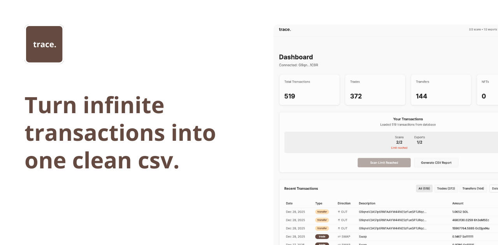

# Trace - Solana Tax Tracker

**Every trade, tracked automatically.**

Generate Solana tax reports in seconds with FIFO/LIFO support, multi-wallet tracking, and accountant-ready CSV exports.



## Features

- **Automatic Transaction Tracking** - Scan any Solana wallet address for all transactions
- **Tax Report Generation** - Generate CSV reports with cost basis calculations
- **FIFO/LIFO Support** - Choose your preferred accounting method
- **Multi-Wallet Support** - Track multiple wallets in one dashboard
- **Plan Limitations** - Free plan with 2 scans and 2 exports, Pro plan for unlimited
- **Solana Wallet Auth** - Sign in with your Solana wallet (Phantom, Solflare, etc.)
- **Real-time Updates** - Live transaction scanning via Helius API
- **Type Detection** - Automatically categorizes swaps, transfers, NFT sales, and more

## Tech Stack

- **Framework**: Next.js 14 (App Router)
- **Language**: TypeScript
- **Styling**: Tailwind CSS + shadcn/ui
- **Database**: Supabase (PostgreSQL)
- **Auth**: Supabase Auth + Solana Wallet Adapter
- **Blockchain API**: Helius (Solana transactions)
- **Animations**: Framer Motion
- **State Management**: React Context
- **Toast Notifications**: Sonner

## Prerequisites

Before you begin, ensure you have:

- **Node.js** 18.x or higher
- **npm** or **pnpm**
- **Supabase account** (free tier works)
- **Helius API key** (free tier available)

## Installation

### 1. Clone the repository

```bash
git clone <your-repo-url>
cd dtax
```

### 2. Install dependencies

```bash
npm install
# or
pnpm install
```

### 3. Set up environment variables

Create a `.env.local` file in the root directory:

```env
# Supabase
NEXT_PUBLIC_SUPABASE_URL=your_supabase_project_url
NEXT_PUBLIC_SUPABASE_ANON_KEY=your_supabase_anon_key
SUPABASE_SERVICE_ROLE_KEY=your_supabase_service_role_key

# Helius API
NEXT_PUBLIC_HELIUS_API_KEY=your_helius_api_key

# App URL (for production)
NEXT_PUBLIC_APP_URL=http://localhost:3000
```

#### Getting your keys:

**Supabase:**
1. Go to [supabase.com](https://supabase.com)
2. Create a new project
3. Go to Project Settings > API
4. Copy `URL` and `anon public` key
5. Copy `service_role` key (keep this secret!)

**Helius:**
1. Go to [helius.dev](https://www.helius.dev)
2. Create a free account
3. Create a new API key
4. Copy the API key

### 4. Set up the database

Run the Supabase migrations to create the required tables:

```bash
# Make sure you have Supabase CLI installed
npm install -g supabase

# Link your project
supabase link --project-ref your_project_ref

# Run migrations
supabase db push
```

**Or manually apply migrations:**

Navigate to your Supabase project dashboard > SQL Editor and run the migrations in order:

1. `supabase/migrations/001_initial_schema.sql`
2. `supabase/migrations/002_add_transactions.sql`
3. `supabase/migrations/003_add_rls_policies.sql`
4. `supabase/migrations/008_add_usage_tracking.sql`
5. `supabase/migrations/009_fix_rls_policies.sql`

### 5. Configure Supabase Auth (Optional)

If you want to enable additional auth providers:

1. Go to Authentication > Providers in Supabase dashboard
2. Enable **Google OAuth** (optional)
3. Add your redirect URLs: `http://localhost:3000/auth/callback`

### 6. Run the development server

```bash
npm run dev
# or
pnpm dev
```

Open [http://localhost:3000](http://localhost:3000) in your browser.

## Database Schema

### Tables

**profiles**
- Stores user profiles and plan information
- Tracks scan/export usage counts
- Links to Supabase auth users

**transactions**
- Stores all scanned Solana transactions
- Includes type detection, token info, amounts
- Linked to user's wallet address

### Row Level Security (RLS)

All tables have RLS policies enabled:
- Users can only read their own data
- Users can only update their own profiles
- Admins can manage all data

## Project Structure

```
dtax/
├── app/
│   ├── (auth)/
│   │   └── login/              # Login page with wallet connect
│   ├── dashboard/              # Protected dashboard pages
│   │   ├── page.tsx            # Main dashboard
│   │   └── transaction/[id]/   # Transaction details
│   ├── layout.tsx              # Root layout with metadata
│   ├── page.tsx                # Landing page
│   ├── opengraph-image.tsx     # Dynamic OG image
│   └── sitemap.ts              # Dynamic sitemap
├── components/
│   ├── ui/                     # shadcn/ui components
│   ├── auth-provider.tsx       # Auth context
│   ├── plan-provider.tsx       # Plan & usage context
│   ├── wallet-provider.tsx     # Solana wallet adapter
│   ├── navbar.tsx              # Navigation bar
│   └── footer.tsx              # Footer component
├── hooks/
│   └── use-wallet-auth.ts      # Custom wallet auth hook
├── lib/
│   ├── supabase.ts             # Supabase client
│   ├── helius.ts               # Helius API client
│   ├── csv-export.ts           # CSV generation
│   ├── seo-config.ts           # SEO metadata
│   └── utils.ts                # Utility functions
├── supabase/
│   └── migrations/             # Database migrations
└── public/
    ├── robots.txt
    └── site.webmanifest
```

## Usage

### 1. Connect your wallet
- Click "Connect Wallet" in the navbar
- Select your wallet (Phantom, Solflare, etc.)
- Sign the authentication message

### 2. Scan transactions
- Enter a Solana wallet address in the dashboard
- Click "Scan for New Transactions"
- Wait for transactions to be fetched and analyzed

### 3. Generate CSV report
- Click "Generate CSV Report" to export all transactions
- Opens a CSV file with all transaction details

### 4. Plan limits (Free tier)
- 2 scans per wallet
- 2 CSV exports per wallet
- Upgrade to Pro for unlimited usage

## Development

### Running migrations

```bash
# Create a new migration
supabase migration new migration_name

# Apply migrations
supabase db push

# Reset database (WARNING: deletes all data)
supabase db reset
```

### Type generation

```bash
# Generate TypeScript types from Supabase schema
supabase gen types typescript --local > types/supabase.ts
```

### Building for production

```bash
npm run build
npm run start
```

## Environment Variables Reference

| Variable | Description | Required |
|----------|-------------|----------|
| `NEXT_PUBLIC_SUPABASE_URL` | Your Supabase project URL | Yes |
| `NEXT_PUBLIC_SUPABASE_ANON_KEY` | Supabase anonymous key | Yes |
| `SUPABASE_SERVICE_ROLE_KEY` | Supabase service role key (server-side only) | Yes |
| `NEXT_PUBLIC_HELIUS_API_KEY` | Helius API key for Solana data | Yes |
| `NEXT_PUBLIC_APP_URL` | App URL (for production) | No |

## Troubleshooting

### "Error loading plan" or RLS policy errors
- Make sure all migrations are applied
- Check that RLS policies exist in Supabase dashboard
- Verify your service role key is correct

### Wallet connection issues
- Clear browser cache and localStorage
- Try a different wallet provider
- Check browser console for errors

### Transaction scanning fails
- Verify your Helius API key is valid
- Check API rate limits (free tier: 100 requests/day)
- Ensure the wallet address is valid

### TypeScript errors with Framer Motion
- This is a known issue with React 19
- The project includes type declarations in `/types/framer-motion.d.ts`
- If errors persist, run `npm install` again

## Contributing

Contributions are welcome! Please follow these steps:

1. Fork the repository
2. Create a feature branch (`git checkout -b feature/amazing-feature`)
3. Commit your changes (`git commit -m 'Add amazing feature'`)
4. Push to the branch (`git push origin feature/amazing-feature`)
5. Open a Pull Request

## License

[MIT License](LICENSE) - feel free to use this project for personal or commercial purposes.

## Support

For issues and questions:
- Open an issue on GitHub
- Contact: [your-email@example.com]

## Roadmap

- [ ] PDF report generation
- [ ] Tax calculation engine (FIFO/LIFO)
- [ ] Historical price fetching (CoinGecko)
- [ ] Multi-year reports
- [ ] Pro plan with Stripe payments
- [ ] Email notifications
- [ ] API endpoints for external integrations

---

Built with ❤️ using Next.js and Supabase